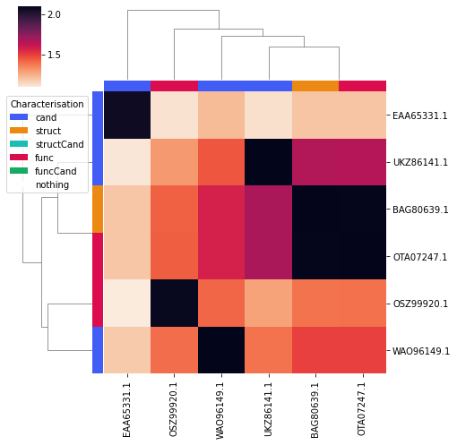
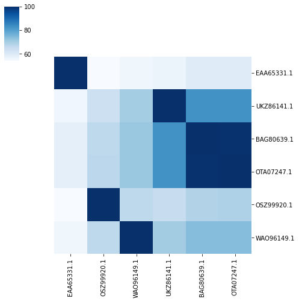
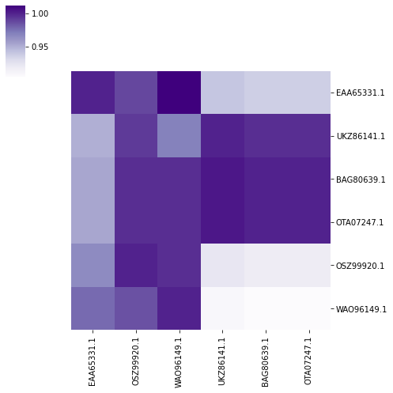

.. _example seq div:

Explore Sequence Diversity
==========================

This page contains the contents for a jupyter notebook used to demonstrate using ``cazomevolve`` to explore 
the sequence diversity in the CAZy family PL20.

The original notebook can be found `here <https://github.com/HobnobMancer/cazomevolve/blob/master/cazomevolve/seq_diversity/explore_seq_diversity.ipynb>`_ and which can be used as a template.

--------
Notebook
--------

This notebook is for exploring protein sequence diversity in a set of CAZymes, e.g. a CAZy family.

Prior to using this notebook:

1. Build a local CAZyme db using ``cazy_webscraper``
2. Retrieve the protein sequences for each CAZy family of interest using
   the ``cazomevole`` subcommand ``get_fam_seqs``
3. Run all-vs-all analysis using BLAST or DIAMOND using the
   ``cazomevolve`` subcommands ``run_fam_blast`` and
   ``run_fam_diamond``, respectively

This notebook takes as input the output from BLASTP+/DIAMOND and
visualises the data.

Feel free to use this notebook as a template to perform further
analyses.

Imports
-------

.. code:: ipython3

    import seaborn as sns
    
    from cazomevolve.seq_diversity.explore.cazy import get_cazy_proteins, get_cazy_db_prots
    from cazomevolve.seq_diversity.explore.parse import load_data, remove_redunant_prots
    from cazomevolve.seq_diversity.explore.plot import plot_clustermap, plot_heatmap_of_clustermap

Constants
---------

Define proteins of interest, e.g. proteins to be explored in the lab.
These will be highlighed on the resulting clustermaps and heatmaps.

The ``dict`` uses the group name (e.g. a CAZy family) as the key, and is
valued by a list of the NCBI protein version accessions.

.. code:: ipython3

    CANDIDATES = {
        'PL20': ['EAA65331.1', 'UKZ86141.1', 'WAO96149.1']
    }

Get ‘characterised’ proteins from CAZy
--------------------------------------

To retrieve proteins listed in the ‘characterised’ or ‘structure’ tables
in CAZy, using the ``get_cazy_db_prots`` function.

We store proteins listed in the characterised table in the variable
``characterised_prots``, and proteins in the structure table are listed
in ``structure_prots``.

.. code:: ipython3

    characterised_prots = {}  # {fam: [prot acc]}
    characterised_prots['PL20'] = get_cazy_db_prots('PL20', characterised=True)
    characterised_prots

.. parsed-literal::

    Parsing characterised table for PL20: 100%|██████████| 7/7 [00:00<00:00, 5420.00it/s]

.. parsed-literal::

    {'PL20': ['BAG80639.1', 'OSZ99920.1', 'OTA07247.1']}

.. code:: ipython3

    structured_prots = {}  # {fam: [prot acc]}
    structured_prots['PL20'] = get_cazy_db_prots('PL20', structured=True)
    structured_prots

.. parsed-literal::

    Parsing structured table for PL20: 100%|██████████| 7/7 [00:00<00:00, 9031.11it/s]

.. parsed-literal::

    {'PL20': ['BAG80639.1']}

Family analysis
---------------

Here is some example code for running the analysis for CAZy family PL20.

.. code:: ipython3

    # load data
    pl20_df = load_data('../../docs/examples/pl20/pl20_blastp', 'PL20')
    pl20_df.head(5)

.. parsed-literal::

    Identifying IPGs:   0%|          | 0/110 [00:00<?, ?it/s]

.. parsed-literal::

    Identified 8 groups of identical proteins

.. raw:: html

    

    
    <table border="1" class="dataframe">
      <thead>
        <tr style="text-align: right;">
          <th></th>
          <th>qseqid</th>
          <th>sseqid</th>
          <th>qlen</th>
          <th>slen</th>
          <th>length</th>
          <th>pident</th>
          <th>evalue</th>
          <th>bitscore</th>
          <th>BSR</th>
          <th>qcov</th>
          <th>scov</th>
        </tr>
      </thead>
      <tbody>
        <tr>
          <th>0</th>
          <td>EAQ84327.1</td>
          <td>EAQ84327.1</td>
          <td>250</td>
          <td>250</td>
          <td>250</td>
          <td>100.000</td>
          <td>0.000000e+00</td>
          <td>520.0</td>
          <td>2.080</td>
          <td>1.000</td>
          <td>1.000000</td>
        </tr>
        <tr>
          <th>1</th>
          <td>EAQ84327.1</td>
          <td>AEO59473.1</td>
          <td>250</td>
          <td>250</td>
          <td>250</td>
          <td>79.600</td>
          <td>6.520000e-157</td>
          <td>428.0</td>
          <td>1.712</td>
          <td>1.000</td>
          <td>1.000000</td>
        </tr>
        <tr>
          <th>2</th>
          <td>EAQ84327.1</td>
          <td>EDP51830.1</td>
          <td>250</td>
          <td>292</td>
          <td>254</td>
          <td>57.874</td>
          <td>4.100000e-109</td>
          <td>309.0</td>
          <td>1.236</td>
          <td>1.016</td>
          <td>0.869863</td>
        </tr>
        <tr>
          <th>3</th>
          <td>EAQ84327.1</td>
          <td>QSQ14196.1</td>
          <td>250</td>
          <td>255</td>
          <td>251</td>
          <td>53.785</td>
          <td>3.570000e-101</td>
          <td>287.0</td>
          <td>1.148</td>
          <td>1.004</td>
          <td>0.984314</td>
        </tr>
        <tr>
          <th>4</th>
          <td>EAQ84327.1</td>
          <td>QSQ27087.1</td>
          <td>250</td>
          <td>255</td>
          <td>247</td>
          <td>54.251</td>
          <td>3.500000e-100</td>
          <td>285.0</td>
          <td>1.140</td>
          <td>0.988</td>
          <td>0.968627</td>
        </tr>
      </tbody>
    </table>
    

.. code:: ipython3

    # build clustermap of BLAST Score Ratio
    pl20_bsr_plt = plot_clustermap(pl20_df, 'PL20', 'BSR', fig_size=(100, 100), save_fig='pl20_clustermap.png')
    pl20_bsr_plt

.. parsed-literal::

    <seaborn.matrix.ClusterGrid at 0x7fbb8c265460>

.. image:: output_10_1.png

.. code:: ipython3

    # plot a clustermap of only the candidates and functionally/structurally characterised proteins
    # that is also annotated to differentiate, candidates and functionally/structurally characterised proteins
    pl20_char_bsr_plt = plot_clustermap(
        pl20_df,
        'PL20',
        'BSR',
        fig_size=(7, 7),
        char_only=True,
        annotate=True,
        candidates=CANDIDATES, structured_prots=structured_prots, characterised_prots=characterised_prots,
    )
    pl20_char_bsr_plt

.. parsed-literal::

    <seaborn.matrix.ClusterGrid at 0x7fbb7b99f520>

Then plot the precentage identity and query coverage for the candidate
and functionally/structurally characterised proteins, plotting the
proteins on the heatmaps in the same order as they appear in the
clustermap.

.. code:: ipython3

    print('PL20 percentage identity, colour scheme blue')
    plot_heatmap_of_clustermap(
        pl20_char_bsr_plt,
        pl20_df,
        'PL20',
        'pident',
        fig_size=(7, 7),
        colour_scheme=sns.color_palette("Blues", as_cmap=True),
        candidates=CANDIDATES, structured_prots=structured_prots, characterised_prots=characterised_prots,
    )

.. parsed-literal::

    PL20 percentage identity, colour scheme blue

.. code:: ipython3

    print('PL20 query coverage, colour scheme purple')
    plot_heatmap_of_clustermap(
        pl20_char_bsr_plt,
        pl20_df,
        'PL20',
        'qcov',
        fig_size=(7, 7),
        colour_scheme=sns.color_palette("Purples", as_cmap=True),
        candidates=CANDIDATES, structured_prots=structured_prots, characterised_prots=characterised_prots,
    )

.. parsed-literal::

    PL20 query coverage, colour scheme purple

